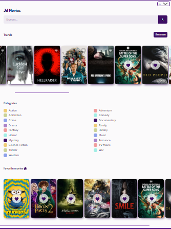

# $\color[RGB]{54,148,77} API$ $\color[RGB]{54,148,77} REST$ $\color[RGB]{54,148,77} practice$ $\color[RGB]{54,148,77} course$  $\color[RGB]{54,148,77} @Platzi$

<kbd>
  
</kbd>

### $\color[RGB]{54,148,77} Built$  $\color[RGB]{54,148,77} with$
- Semantic HTML5 markup
- CSS custom properties
- Flexbox
- API REST

### $\color[RGB]{54,148,77} What$ $\color[RGB]{54,148,77} I$ $\color[RGB]{54,148,77} learned$
- Root variables in css
- create like buttons and some animations
- Filter searchs
- Manipulate api data from moviedb
- Intersecting Observer
- DOM manipulation
- Organizing my files better

## $\color[RGB]{54,148,77} Author $

- Website - [Live website](https://curso-api-rest-practico.vercel.app)
- Platzi - [Profile](https://platzi.com/p/jdaniel.c74/)
